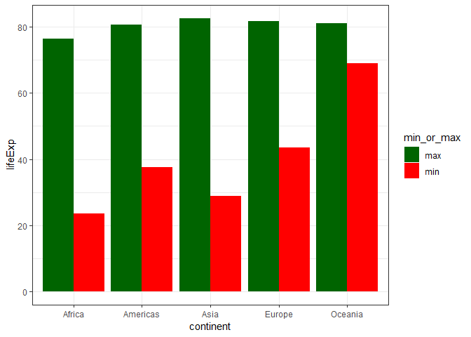
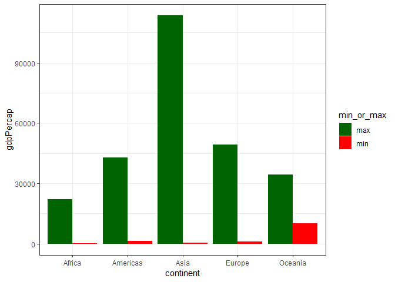

# Homework 06: Data wrangling wrap up

Load packages


```r
suppressPackageStartupMessages(library(tidyverse))
library(stringr)
suppressPackageStartupMessages(library(testthat))
suppressPackageStartupMessages(library(lazyeval))
library(gapminder)
library(knitr)
library(repurrrsive)
library(listviewer)
```

## 1. Character data

Read and work the exercises in the Strings chapter or R for Data Science.

### 14.2.5 Exercises

__In code that doesn’t use stringr, you’ll often see paste() and paste0(). What’s the difference between the two functions? What stringr function are they equivalent to? How do the functions differ in their handling of NA?__

You can look at the help files for `?paste` annd `?paste0`.

`paste (..., sep = " ", collapse = NULL)`

`paste0(..., collapse = NULL)`

We can see that `paste` allows use to use a `sep`. With `paste0`, you essentially must use `sep = ""`. Example:


```r
paste("Alvin", "Qiu", "No", "Spaces", sep = "")
```

```
## [1] "AlvinQiuNoSpaces"
```

```r
paste0("Alvin", "Qiu", "No", "Spaces")
```

```
## [1] "AlvinQiuNoSpaces"
```

These above were equivalent.


```r
paste("Alvin", "Qiu", "With", "Spaces", sep = " ")
```

```
## [1] "Alvin Qiu With Spaces"
```

Here, I use `sep` to introduce spaces.

The equivalent stringr function is `str_c()`. Building from aboves, let's see an example.


```r
str_c("Alvin", "Qiu", "No", "Spaces", sep = "")
```

```
## [1] "AlvinQiuNoSpaces"
```

```r
str_c("Alvin", "Qiu", "With", "Spaces", sep = " ")
```

```
## [1] "Alvin Qiu With Spaces"
```

NA's are handled differently.

With `paste`:


```r
paste("We have an NA here: ", NA, sep = "")
```

```
## [1] "We have an NA here: NA"
```

```r
paste0("We have an NA here: ", NA)
```

```
## [1] "We have an NA here: NA"
```

`NA` appears as "NA" and is concatenated.

With `str_c`:


```r
str_c("We have an NA here: ", NA, sep = "")
```

```
## [1] NA
```


The entire output is now `NA`. No concatenation.

__In your own words, describe the difference between the sep and collapse arguments to str_c().__

Imagine we have multiple vectors of strings and we want to use `str_c`.


```r
(names <- c("Alvin", "Bryan", "Carl"))
```

```
## [1] "Alvin" "Bryan" "Carl"
```

```r
(fav_food <- c("Apple", "Bread", "Chocolate"))
```

```
## [1] "Apple"     "Bread"     "Chocolate"
```

Using `sep` will be the space between each respective element in the vectors.


```r
str_c(names, fav_food, sep = ": ")
```

```
## [1] "Alvin: Apple"    "Bryan: Bread"    "Carl: Chocolate"
```

The output is a vector of 3 strings here. We can use `collapse` to then combine each of these concatenated string vectors into 1 string. `collaspe` will be the space between each of these elements here.


```r
str_c(names, fav_food, sep = ": ", collapse = " ---- ")
```

```
## [1] "Alvin: Apple ---- Bryan: Bread ---- Carl: Chocolate"
```

__Use str_length() and str_sub() to extract the middle character from a string. What will you do if the string has an even number of characters?__

Let's start with an odd number of characters.


```r
(test_string <- "Alvin")
```

```
## [1] "Alvin"
```

```r
str_sub(test_string, start = str_length(test_string)/2 + 1, end = str_length(test_string)/2 + 1)
```

```
## [1] "v"
```

We can see the "v" is the middle character.

Now let's try an even number of characters. We want the middle 2.


```r
(test_string <- "AlvinQiu")
```

```
## [1] "AlvinQiu"
```

```r
str_sub(test_string, start = str_length(test_string)/2, end = str_length(test_string)/2 + 1)
```

```
## [1] "in"
```


We can see the "in" are the middle 2 characters.

__What does str_wrap() do? When might you want to use it?__

For a long line of text, `str_wrap` can "wrap" the string. In "implements the Knuth-Plass paragraph wrapping algorithm". Essentially the line of text gets broken into multiple lines with a set length. This way it can fit into a screen or page width that is predetermined.

Let's see an example with a line from an UpToDate article titled "Vancomycin: Parenteral dosing, monitoring, and adverse effects in adults":


```r
test_string <- "The optimal method for determining the initial vancomycin dose and interval that most reliably achieves target serum trough concentrations is uncertain; protocols vary between institutions [10]. For initial dosing in most hospitalized patients, we use the nomogram outlined in the table (table 1), based on actual body weight and creatinine clearance using the Cockcroft-Gault equation (calculator 1). However, use of the Cockcroft-Gault equation may result in overestimation of vancomycin clearance in older adults and in patients with low muscle mass (eg, amputees, cerebral palsy). In these patients, more conservative (ie, less frequent) dosing and/or use of an alternate method for assessment of renal function is appropriate. Issues related to assessment of renal function are reviewed separately. (See Assessment of kidney function.)"
```

Let's output the string.


```r
cat(test_string)
```

```
## The optimal method for determining the initial vancomycin dose and interval that most reliably achieves target serum trough concentrations is uncertain; protocols vary between institutions [10]. For initial dosing in most hospitalized patients, we use the nomogram outlined in the table (table 1), based on actual body weight and creatinine clearance using the Cockcroft-Gault equation (calculator 1). However, use of the Cockcroft-Gault equation may result in overestimation of vancomycin clearance in older adults and in patients with low muscle mass (eg, amputees, cerebral palsy). In these patients, more conservative (ie, less frequent) dosing and/or use of an alternate method for assessment of renal function is appropriate. Issues related to assessment of renal function are reviewed separately. (See Assessment of kidney function.)
```

Let's use `str_wrap` with a width of 80 (this is also the default).


```r
cat(str_wrap(test_string), "\n")
```

```
## The optimal method for determining the initial vancomycin dose and interval
## that most reliably achieves target serum trough concentrations is uncertain;
## protocols vary between institutions [10]. For initial dosing in most
## hospitalized patients, we use the nomogram outlined in the table (table 1),
## based on actual body weight and creatinine clearance using the Cockcroft-
## Gault equation (calculator 1). However, use of the Cockcroft-Gault equation may
## result in overestimation of vancomycin clearance in older adults and in patients
## with low muscle mass (eg, amputees, cerebral palsy). In these patients, more
## conservative (ie, less frequent) dosing and/or use of an alternate method for
## assessment of renal function is appropriate. Issues related to assessment of
## renal function are reviewed separately. (See Assessment of kidney function.)
```

Now we can change the width.


```r
cat(str_wrap(test_string, width = 40), "\n")
```

```
## The optimal method for determining
## the initial vancomycin dose and
## interval that most reliably achieves
## target serum trough concentrations
## is uncertain; protocols vary between
## institutions [10]. For initial dosing
## in most hospitalized patients, we use
## the nomogram outlined in the table
## (table 1), based on actual body weight
## and creatinine clearance using the
## Cockcroft-Gault equation (calculator
## 1). However, use of the Cockcroft-Gault
## equation may result in overestimation
## of vancomycin clearance in older adults
## and in patients with low muscle mass
## (eg, amputees, cerebral palsy). In
## these patients, more conservative (ie,
## less frequent) dosing and/or use of an
## alternate method for assessment of renal
## function is appropriate. Issues related
## to assessment of renal function are
## reviewed separately. (See Assessment of
## kidney function.)
```

__What does str_trim() do? What’s the opposite of str_trim()?__

`str_trim` removes whitespaces (like spaces) from the start and end of a string.


```r
(test_string <- "   AlvinQiu   ")
```

```
## [1] "   AlvinQiu   "
```

```r
str_trim(test_string)
```

```
## [1] "AlvinQiu"
```

Note that the 3 starting and ending spaces are removed.

The opposite is `str_pad`. We can add spaces or other characters to either the left, right or both, until a desired length.


```r
(test_string <- c("Alvin", "Qiu", "STAT", "Assignment"))
```

```
## [1] "Alvin"      "Qiu"        "STAT"       "Assignment"
```

```r
str_pad(test_string, width = 10, side = "left", pad = "$")
```

```
## [1] "$$$$$Alvin" "$$$$$$$Qiu" "$$$$$$STAT" "Assignment"
```

We padded the left of the string with "$" so that the length is at least 10 here.


```r
str_pad(test_string, width = 15, side = "right", pad = "*")
```

```
## [1] "Alvin**********" "Qiu************" "STAT***********" "Assignment*****"
```

Here, we pad the right with "*" until a length of 15.

__Write a function that turns (e.g.) a vector c("a", "b", "c") into the string a, b, and c. Think carefully about what it should do if given a vector of length 0, 1, or 2.__

For my function, given a vector of a,b,c ... z :
-if the length is 0, return an empty string ""
-if the length is 1, return "a"
-if the length is 2, return "a and b"
-else, return "a, b, ...., and z"


```r
vec_to_str <- function(x) {
  if (length(x) == 0) {
    return("")
  }
  else if (length(x) == 1) {
    return(x)
  }
  else if (length(x) == 2) {
    return(str_c(x, collapse = " and "))
  }
  else {
    # part 1: concat all elements except the last one into a string with ", " seperating
    part1 <- str_c(x[-length(x)], collapse = ", ")
    
    # part 2: concat with ", and" and then the last element
    part2 <- str_c(part1, x[length(x)], sep = ", and ")
    
    # return
    return(part2)
  }
}
```

Now test this function with `testthat`.


```r
test_that("vec_to_str() failed", {
  # length = 0
  expect_equal(vec_to_str(c()), "")
  
  # length = 1
  expect_equal(vec_to_str(c("a")), "a")
  
  # length = 2
  expect_equal(vec_to_str(c("a", "b")), "a and b")
  
  # length = 3
  expect_equal(vec_to_str(c("a", "b", "c")), "a, b, and c")
  
  # length = 4
  expect_equal(vec_to_str(c("a", "b", "c", "d")), "a, b, c, and d")
})
```

No error.

We can also output the results.


```r
vec_to_str(c())
```

```
## [1] ""
```

```r
vec_to_str(c("a"))
```

```
## [1] "a"
```

```r
vec_to_str(c("a", "b"))
```

```
## [1] "a and b"
```

```r
vec_to_str(c("a", "b", "c"))
```

```
## [1] "a, b, and c"
```

```r
vec_to_str(c("a", "b", "c", "d"))
```

```
## [1] "a, b, c, and d"
```

### 14.3.2.1 Exercises

__How would you match the literal string "$^$"?__


```r
str_view("Alvin$^$Qiu", pattern = "\\$\\^\\$", match = TRUE)
```

<!--html_preserve--><div id="htmlwidget-9eaa54d0534d1d1faaad" style="width:960px;height:100%;" class="str_view html-widget"></div>
<script type="application/json" data-for="htmlwidget-9eaa54d0534d1d1faaad">{"x":{"html":"<ul>\n  <li>Alvin<span class='match'>$^$<\/span>Qiu<\/li>\n<\/ul>"},"evals":[],"jsHooks":[]}</script><!--/html_preserve-->

__Given the corpus of common words in stringr::words, create regular expressions that find all words that:__

__Start with “y”.__


```r
str_view(words, pattern = "^y", match = TRUE)
```

<!--html_preserve--><div id="htmlwidget-8dd25466a9ea405e245e" style="width:960px;height:100%;" class="str_view html-widget"></div>
<script type="application/json" data-for="htmlwidget-8dd25466a9ea405e245e">{"x":{"html":"<ul>\n  <li><span class='match'>y<\/span>ear<\/li>\n  <li><span class='match'>y<\/span>es<\/li>\n  <li><span class='match'>y<\/span>esterday<\/li>\n  <li><span class='match'>y<\/span>et<\/li>\n  <li><span class='match'>y<\/span>ou<\/li>\n  <li><span class='match'>y<\/span>oung<\/li>\n<\/ul>"},"evals":[],"jsHooks":[]}</script><!--/html_preserve-->

__End with “x”__


```r
str_view(words, pattern = "x$", match = TRUE)
```

<!--html_preserve--><div id="htmlwidget-88ffbbebf01616fcbca0" style="width:960px;height:100%;" class="str_view html-widget"></div>
<script type="application/json" data-for="htmlwidget-88ffbbebf01616fcbca0">{"x":{"html":"<ul>\n  <li>bo<span class='match'>x<\/span><\/li>\n  <li>se<span class='match'>x<\/span><\/li>\n  <li>si<span class='match'>x<\/span><\/li>\n  <li>ta<span class='match'>x<\/span><\/li>\n<\/ul>"},"evals":[],"jsHooks":[]}</script><!--/html_preserve-->

__Are exactly three letters long. (Don’t cheat by using str_length()!)__


```r
str_view(words, pattern = "^.{3}$", match = TRUE)
```

<!--html_preserve--><div id="htmlwidget-6610c00f3d94c4ea1fd0" style="width:960px;height:100%;" class="str_view html-widget"></div>
<script type="application/json" data-for="htmlwidget-6610c00f3d94c4ea1fd0">{"x":{"html":"<ul>\n  <li><span class='match'>act<\/span><\/li>\n  <li><span class='match'>add<\/span><\/li>\n  <li><span class='match'>age<\/span><\/li>\n  <li><span class='match'>ago<\/span><\/li>\n  <li><span class='match'>air<\/span><\/li>\n  <li><span class='match'>all<\/span><\/li>\n  <li><span class='match'>and<\/span><\/li>\n  <li><span class='match'>any<\/span><\/li>\n  <li><span class='match'>arm<\/span><\/li>\n  <li><span class='match'>art<\/span><\/li>\n  <li><span class='match'>ask<\/span><\/li>\n  <li><span class='match'>bad<\/span><\/li>\n  <li><span class='match'>bag<\/span><\/li>\n  <li><span class='match'>bar<\/span><\/li>\n  <li><span class='match'>bed<\/span><\/li>\n  <li><span class='match'>bet<\/span><\/li>\n  <li><span class='match'>big<\/span><\/li>\n  <li><span class='match'>bit<\/span><\/li>\n  <li><span class='match'>box<\/span><\/li>\n  <li><span class='match'>boy<\/span><\/li>\n  <li><span class='match'>bus<\/span><\/li>\n  <li><span class='match'>but<\/span><\/li>\n  <li><span class='match'>buy<\/span><\/li>\n  <li><span class='match'>can<\/span><\/li>\n  <li><span class='match'>car<\/span><\/li>\n  <li><span class='match'>cat<\/span><\/li>\n  <li><span class='match'>cup<\/span><\/li>\n  <li><span class='match'>cut<\/span><\/li>\n  <li><span class='match'>dad<\/span><\/li>\n  <li><span class='match'>day<\/span><\/li>\n  <li><span class='match'>die<\/span><\/li>\n  <li><span class='match'>dog<\/span><\/li>\n  <li><span class='match'>dry<\/span><\/li>\n  <li><span class='match'>due<\/span><\/li>\n  <li><span class='match'>eat<\/span><\/li>\n  <li><span class='match'>egg<\/span><\/li>\n  <li><span class='match'>end<\/span><\/li>\n  <li><span class='match'>eye<\/span><\/li>\n  <li><span class='match'>far<\/span><\/li>\n  <li><span class='match'>few<\/span><\/li>\n  <li><span class='match'>fit<\/span><\/li>\n  <li><span class='match'>fly<\/span><\/li>\n  <li><span class='match'>for<\/span><\/li>\n  <li><span class='match'>fun<\/span><\/li>\n  <li><span class='match'>gas<\/span><\/li>\n  <li><span class='match'>get<\/span><\/li>\n  <li><span class='match'>god<\/span><\/li>\n  <li><span class='match'>guy<\/span><\/li>\n  <li><span class='match'>hit<\/span><\/li>\n  <li><span class='match'>hot<\/span><\/li>\n  <li><span class='match'>how<\/span><\/li>\n  <li><span class='match'>job<\/span><\/li>\n  <li><span class='match'>key<\/span><\/li>\n  <li><span class='match'>kid<\/span><\/li>\n  <li><span class='match'>lad<\/span><\/li>\n  <li><span class='match'>law<\/span><\/li>\n  <li><span class='match'>lay<\/span><\/li>\n  <li><span class='match'>leg<\/span><\/li>\n  <li><span class='match'>let<\/span><\/li>\n  <li><span class='match'>lie<\/span><\/li>\n  <li><span class='match'>lot<\/span><\/li>\n  <li><span class='match'>low<\/span><\/li>\n  <li><span class='match'>man<\/span><\/li>\n  <li><span class='match'>may<\/span><\/li>\n  <li><span class='match'>mrs<\/span><\/li>\n  <li><span class='match'>new<\/span><\/li>\n  <li><span class='match'>non<\/span><\/li>\n  <li><span class='match'>not<\/span><\/li>\n  <li><span class='match'>now<\/span><\/li>\n  <li><span class='match'>odd<\/span><\/li>\n  <li><span class='match'>off<\/span><\/li>\n  <li><span class='match'>old<\/span><\/li>\n  <li><span class='match'>one<\/span><\/li>\n  <li><span class='match'>out<\/span><\/li>\n  <li><span class='match'>own<\/span><\/li>\n  <li><span class='match'>pay<\/span><\/li>\n  <li><span class='match'>per<\/span><\/li>\n  <li><span class='match'>put<\/span><\/li>\n  <li><span class='match'>red<\/span><\/li>\n  <li><span class='match'>rid<\/span><\/li>\n  <li><span class='match'>run<\/span><\/li>\n  <li><span class='match'>say<\/span><\/li>\n  <li><span class='match'>see<\/span><\/li>\n  <li><span class='match'>set<\/span><\/li>\n  <li><span class='match'>sex<\/span><\/li>\n  <li><span class='match'>she<\/span><\/li>\n  <li><span class='match'>sir<\/span><\/li>\n  <li><span class='match'>sit<\/span><\/li>\n  <li><span class='match'>six<\/span><\/li>\n  <li><span class='match'>son<\/span><\/li>\n  <li><span class='match'>sun<\/span><\/li>\n  <li><span class='match'>tax<\/span><\/li>\n  <li><span class='match'>tea<\/span><\/li>\n  <li><span class='match'>ten<\/span><\/li>\n  <li><span class='match'>the<\/span><\/li>\n  <li><span class='match'>tie<\/span><\/li>\n  <li><span class='match'>too<\/span><\/li>\n  <li><span class='match'>top<\/span><\/li>\n  <li><span class='match'>try<\/span><\/li>\n  <li><span class='match'>two<\/span><\/li>\n  <li><span class='match'>use<\/span><\/li>\n  <li><span class='match'>war<\/span><\/li>\n  <li><span class='match'>way<\/span><\/li>\n  <li><span class='match'>wee<\/span><\/li>\n  <li><span class='match'>who<\/span><\/li>\n  <li><span class='match'>why<\/span><\/li>\n  <li><span class='match'>win<\/span><\/li>\n  <li><span class='match'>yes<\/span><\/li>\n  <li><span class='match'>yet<\/span><\/li>\n  <li><span class='match'>you<\/span><\/li>\n<\/ul>"},"evals":[],"jsHooks":[]}</script><!--/html_preserve-->

__Have seven letters or more.__


```r
str_view(words, pattern = "^.{7,}$", match = TRUE)
```

<!--html_preserve--><div id="htmlwidget-92165bc2a9372090bb52" style="width:960px;height:100%;" class="str_view html-widget"></div>
<script type="application/json" data-for="htmlwidget-92165bc2a9372090bb52">{"x":{"html":"<ul>\n  <li><span class='match'>absolute<\/span><\/li>\n  <li><span class='match'>account<\/span><\/li>\n  <li><span class='match'>achieve<\/span><\/li>\n  <li><span class='match'>address<\/span><\/li>\n  <li><span class='match'>advertise<\/span><\/li>\n  <li><span class='match'>afternoon<\/span><\/li>\n  <li><span class='match'>against<\/span><\/li>\n  <li><span class='match'>already<\/span><\/li>\n  <li><span class='match'>alright<\/span><\/li>\n  <li><span class='match'>although<\/span><\/li>\n  <li><span class='match'>america<\/span><\/li>\n  <li><span class='match'>another<\/span><\/li>\n  <li><span class='match'>apparent<\/span><\/li>\n  <li><span class='match'>appoint<\/span><\/li>\n  <li><span class='match'>approach<\/span><\/li>\n  <li><span class='match'>appropriate<\/span><\/li>\n  <li><span class='match'>arrange<\/span><\/li>\n  <li><span class='match'>associate<\/span><\/li>\n  <li><span class='match'>authority<\/span><\/li>\n  <li><span class='match'>available<\/span><\/li>\n  <li><span class='match'>balance<\/span><\/li>\n  <li><span class='match'>because<\/span><\/li>\n  <li><span class='match'>believe<\/span><\/li>\n  <li><span class='match'>benefit<\/span><\/li>\n  <li><span class='match'>between<\/span><\/li>\n  <li><span class='match'>brilliant<\/span><\/li>\n  <li><span class='match'>britain<\/span><\/li>\n  <li><span class='match'>brother<\/span><\/li>\n  <li><span class='match'>business<\/span><\/li>\n  <li><span class='match'>certain<\/span><\/li>\n  <li><span class='match'>chairman<\/span><\/li>\n  <li><span class='match'>character<\/span><\/li>\n  <li><span class='match'>Christmas<\/span><\/li>\n  <li><span class='match'>colleague<\/span><\/li>\n  <li><span class='match'>collect<\/span><\/li>\n  <li><span class='match'>college<\/span><\/li>\n  <li><span class='match'>comment<\/span><\/li>\n  <li><span class='match'>committee<\/span><\/li>\n  <li><span class='match'>community<\/span><\/li>\n  <li><span class='match'>company<\/span><\/li>\n  <li><span class='match'>compare<\/span><\/li>\n  <li><span class='match'>complete<\/span><\/li>\n  <li><span class='match'>compute<\/span><\/li>\n  <li><span class='match'>concern<\/span><\/li>\n  <li><span class='match'>condition<\/span><\/li>\n  <li><span class='match'>consider<\/span><\/li>\n  <li><span class='match'>consult<\/span><\/li>\n  <li><span class='match'>contact<\/span><\/li>\n  <li><span class='match'>continue<\/span><\/li>\n  <li><span class='match'>contract<\/span><\/li>\n  <li><span class='match'>control<\/span><\/li>\n  <li><span class='match'>converse<\/span><\/li>\n  <li><span class='match'>correct<\/span><\/li>\n  <li><span class='match'>council<\/span><\/li>\n  <li><span class='match'>country<\/span><\/li>\n  <li><span class='match'>current<\/span><\/li>\n  <li><span class='match'>decision<\/span><\/li>\n  <li><span class='match'>definite<\/span><\/li>\n  <li><span class='match'>department<\/span><\/li>\n  <li><span class='match'>describe<\/span><\/li>\n  <li><span class='match'>develop<\/span><\/li>\n  <li><span class='match'>difference<\/span><\/li>\n  <li><span class='match'>difficult<\/span><\/li>\n  <li><span class='match'>discuss<\/span><\/li>\n  <li><span class='match'>district<\/span><\/li>\n  <li><span class='match'>document<\/span><\/li>\n  <li><span class='match'>economy<\/span><\/li>\n  <li><span class='match'>educate<\/span><\/li>\n  <li><span class='match'>electric<\/span><\/li>\n  <li><span class='match'>encourage<\/span><\/li>\n  <li><span class='match'>english<\/span><\/li>\n  <li><span class='match'>environment<\/span><\/li>\n  <li><span class='match'>especial<\/span><\/li>\n  <li><span class='match'>evening<\/span><\/li>\n  <li><span class='match'>evidence<\/span><\/li>\n  <li><span class='match'>example<\/span><\/li>\n  <li><span class='match'>exercise<\/span><\/li>\n  <li><span class='match'>expense<\/span><\/li>\n  <li><span class='match'>experience<\/span><\/li>\n  <li><span class='match'>explain<\/span><\/li>\n  <li><span class='match'>express<\/span><\/li>\n  <li><span class='match'>finance<\/span><\/li>\n  <li><span class='match'>fortune<\/span><\/li>\n  <li><span class='match'>forward<\/span><\/li>\n  <li><span class='match'>function<\/span><\/li>\n  <li><span class='match'>further<\/span><\/li>\n  <li><span class='match'>general<\/span><\/li>\n  <li><span class='match'>germany<\/span><\/li>\n  <li><span class='match'>goodbye<\/span><\/li>\n  <li><span class='match'>history<\/span><\/li>\n  <li><span class='match'>holiday<\/span><\/li>\n  <li><span class='match'>hospital<\/span><\/li>\n  <li><span class='match'>however<\/span><\/li>\n  <li><span class='match'>hundred<\/span><\/li>\n  <li><span class='match'>husband<\/span><\/li>\n  <li><span class='match'>identify<\/span><\/li>\n  <li><span class='match'>imagine<\/span><\/li>\n  <li><span class='match'>important<\/span><\/li>\n  <li><span class='match'>improve<\/span><\/li>\n  <li><span class='match'>include<\/span><\/li>\n  <li><span class='match'>increase<\/span><\/li>\n  <li><span class='match'>individual<\/span><\/li>\n  <li><span class='match'>industry<\/span><\/li>\n  <li><span class='match'>instead<\/span><\/li>\n  <li><span class='match'>interest<\/span><\/li>\n  <li><span class='match'>introduce<\/span><\/li>\n  <li><span class='match'>involve<\/span><\/li>\n  <li><span class='match'>kitchen<\/span><\/li>\n  <li><span class='match'>language<\/span><\/li>\n  <li><span class='match'>machine<\/span><\/li>\n  <li><span class='match'>meaning<\/span><\/li>\n  <li><span class='match'>measure<\/span><\/li>\n  <li><span class='match'>mention<\/span><\/li>\n  <li><span class='match'>million<\/span><\/li>\n  <li><span class='match'>minister<\/span><\/li>\n  <li><span class='match'>morning<\/span><\/li>\n  <li><span class='match'>necessary<\/span><\/li>\n  <li><span class='match'>obvious<\/span><\/li>\n  <li><span class='match'>occasion<\/span><\/li>\n  <li><span class='match'>operate<\/span><\/li>\n  <li><span class='match'>opportunity<\/span><\/li>\n  <li><span class='match'>organize<\/span><\/li>\n  <li><span class='match'>original<\/span><\/li>\n  <li><span class='match'>otherwise<\/span><\/li>\n  <li><span class='match'>paragraph<\/span><\/li>\n  <li><span class='match'>particular<\/span><\/li>\n  <li><span class='match'>pension<\/span><\/li>\n  <li><span class='match'>percent<\/span><\/li>\n  <li><span class='match'>perfect<\/span><\/li>\n  <li><span class='match'>perhaps<\/span><\/li>\n  <li><span class='match'>photograph<\/span><\/li>\n  <li><span class='match'>picture<\/span><\/li>\n  <li><span class='match'>politic<\/span><\/li>\n  <li><span class='match'>position<\/span><\/li>\n  <li><span class='match'>positive<\/span><\/li>\n  <li><span class='match'>possible<\/span><\/li>\n  <li><span class='match'>practise<\/span><\/li>\n  <li><span class='match'>prepare<\/span><\/li>\n  <li><span class='match'>present<\/span><\/li>\n  <li><span class='match'>pressure<\/span><\/li>\n  <li><span class='match'>presume<\/span><\/li>\n  <li><span class='match'>previous<\/span><\/li>\n  <li><span class='match'>private<\/span><\/li>\n  <li><span class='match'>probable<\/span><\/li>\n  <li><span class='match'>problem<\/span><\/li>\n  <li><span class='match'>proceed<\/span><\/li>\n  <li><span class='match'>process<\/span><\/li>\n  <li><span class='match'>produce<\/span><\/li>\n  <li><span class='match'>product<\/span><\/li>\n  <li><span class='match'>programme<\/span><\/li>\n  <li><span class='match'>project<\/span><\/li>\n  <li><span class='match'>propose<\/span><\/li>\n  <li><span class='match'>protect<\/span><\/li>\n  <li><span class='match'>provide<\/span><\/li>\n  <li><span class='match'>purpose<\/span><\/li>\n  <li><span class='match'>quality<\/span><\/li>\n  <li><span class='match'>quarter<\/span><\/li>\n  <li><span class='match'>question<\/span><\/li>\n  <li><span class='match'>realise<\/span><\/li>\n  <li><span class='match'>receive<\/span><\/li>\n  <li><span class='match'>recognize<\/span><\/li>\n  <li><span class='match'>recommend<\/span><\/li>\n  <li><span class='match'>relation<\/span><\/li>\n  <li><span class='match'>remember<\/span><\/li>\n  <li><span class='match'>represent<\/span><\/li>\n  <li><span class='match'>require<\/span><\/li>\n  <li><span class='match'>research<\/span><\/li>\n  <li><span class='match'>resource<\/span><\/li>\n  <li><span class='match'>respect<\/span><\/li>\n  <li><span class='match'>responsible<\/span><\/li>\n  <li><span class='match'>saturday<\/span><\/li>\n  <li><span class='match'>science<\/span><\/li>\n  <li><span class='match'>scotland<\/span><\/li>\n  <li><span class='match'>secretary<\/span><\/li>\n  <li><span class='match'>section<\/span><\/li>\n  <li><span class='match'>separate<\/span><\/li>\n  <li><span class='match'>serious<\/span><\/li>\n  <li><span class='match'>service<\/span><\/li>\n  <li><span class='match'>similar<\/span><\/li>\n  <li><span class='match'>situate<\/span><\/li>\n  <li><span class='match'>society<\/span><\/li>\n  <li><span class='match'>special<\/span><\/li>\n  <li><span class='match'>specific<\/span><\/li>\n  <li><span class='match'>standard<\/span><\/li>\n  <li><span class='match'>station<\/span><\/li>\n  <li><span class='match'>straight<\/span><\/li>\n  <li><span class='match'>strategy<\/span><\/li>\n  <li><span class='match'>structure<\/span><\/li>\n  <li><span class='match'>student<\/span><\/li>\n  <li><span class='match'>subject<\/span><\/li>\n  <li><span class='match'>succeed<\/span><\/li>\n  <li><span class='match'>suggest<\/span><\/li>\n  <li><span class='match'>support<\/span><\/li>\n  <li><span class='match'>suppose<\/span><\/li>\n  <li><span class='match'>surprise<\/span><\/li>\n  <li><span class='match'>telephone<\/span><\/li>\n  <li><span class='match'>television<\/span><\/li>\n  <li><span class='match'>terrible<\/span><\/li>\n  <li><span class='match'>therefore<\/span><\/li>\n  <li><span class='match'>thirteen<\/span><\/li>\n  <li><span class='match'>thousand<\/span><\/li>\n  <li><span class='match'>through<\/span><\/li>\n  <li><span class='match'>thursday<\/span><\/li>\n  <li><span class='match'>together<\/span><\/li>\n  <li><span class='match'>tomorrow<\/span><\/li>\n  <li><span class='match'>tonight<\/span><\/li>\n  <li><span class='match'>traffic<\/span><\/li>\n  <li><span class='match'>transport<\/span><\/li>\n  <li><span class='match'>trouble<\/span><\/li>\n  <li><span class='match'>tuesday<\/span><\/li>\n  <li><span class='match'>understand<\/span><\/li>\n  <li><span class='match'>university<\/span><\/li>\n  <li><span class='match'>various<\/span><\/li>\n  <li><span class='match'>village<\/span><\/li>\n  <li><span class='match'>wednesday<\/span><\/li>\n  <li><span class='match'>welcome<\/span><\/li>\n  <li><span class='match'>whether<\/span><\/li>\n  <li><span class='match'>without<\/span><\/li>\n  <li><span class='match'>yesterday<\/span><\/li>\n<\/ul>"},"evals":[],"jsHooks":[]}</script><!--/html_preserve-->

### 14.3.3.1 Exercises

__Create regular expressions to find all words that:__

__Start with a vowel.__


```r
str_view(words, pattern = "^[aeiou]", match = TRUE)
```

<!--html_preserve--><div id="htmlwidget-d9df4b980a67dbcff7b7" style="width:960px;height:100%;" class="str_view html-widget"></div>
<script type="application/json" data-for="htmlwidget-d9df4b980a67dbcff7b7">{"x":{"html":"<ul>\n  <li><span class='match'>a<\/span><\/li>\n  <li><span class='match'>a<\/span>ble<\/li>\n  <li><span class='match'>a<\/span>bout<\/li>\n  <li><span class='match'>a<\/span>bsolute<\/li>\n  <li><span class='match'>a<\/span>ccept<\/li>\n  <li><span class='match'>a<\/span>ccount<\/li>\n  <li><span class='match'>a<\/span>chieve<\/li>\n  <li><span class='match'>a<\/span>cross<\/li>\n  <li><span class='match'>a<\/span>ct<\/li>\n  <li><span class='match'>a<\/span>ctive<\/li>\n  <li><span class='match'>a<\/span>ctual<\/li>\n  <li><span class='match'>a<\/span>dd<\/li>\n  <li><span class='match'>a<\/span>ddress<\/li>\n  <li><span class='match'>a<\/span>dmit<\/li>\n  <li><span class='match'>a<\/span>dvertise<\/li>\n  <li><span class='match'>a<\/span>ffect<\/li>\n  <li><span class='match'>a<\/span>fford<\/li>\n  <li><span class='match'>a<\/span>fter<\/li>\n  <li><span class='match'>a<\/span>fternoon<\/li>\n  <li><span class='match'>a<\/span>gain<\/li>\n  <li><span class='match'>a<\/span>gainst<\/li>\n  <li><span class='match'>a<\/span>ge<\/li>\n  <li><span class='match'>a<\/span>gent<\/li>\n  <li><span class='match'>a<\/span>go<\/li>\n  <li><span class='match'>a<\/span>gree<\/li>\n  <li><span class='match'>a<\/span>ir<\/li>\n  <li><span class='match'>a<\/span>ll<\/li>\n  <li><span class='match'>a<\/span>llow<\/li>\n  <li><span class='match'>a<\/span>lmost<\/li>\n  <li><span class='match'>a<\/span>long<\/li>\n  <li><span class='match'>a<\/span>lready<\/li>\n  <li><span class='match'>a<\/span>lright<\/li>\n  <li><span class='match'>a<\/span>lso<\/li>\n  <li><span class='match'>a<\/span>lthough<\/li>\n  <li><span class='match'>a<\/span>lways<\/li>\n  <li><span class='match'>a<\/span>merica<\/li>\n  <li><span class='match'>a<\/span>mount<\/li>\n  <li><span class='match'>a<\/span>nd<\/li>\n  <li><span class='match'>a<\/span>nother<\/li>\n  <li><span class='match'>a<\/span>nswer<\/li>\n  <li><span class='match'>a<\/span>ny<\/li>\n  <li><span class='match'>a<\/span>part<\/li>\n  <li><span class='match'>a<\/span>pparent<\/li>\n  <li><span class='match'>a<\/span>ppear<\/li>\n  <li><span class='match'>a<\/span>pply<\/li>\n  <li><span class='match'>a<\/span>ppoint<\/li>\n  <li><span class='match'>a<\/span>pproach<\/li>\n  <li><span class='match'>a<\/span>ppropriate<\/li>\n  <li><span class='match'>a<\/span>rea<\/li>\n  <li><span class='match'>a<\/span>rgue<\/li>\n  <li><span class='match'>a<\/span>rm<\/li>\n  <li><span class='match'>a<\/span>round<\/li>\n  <li><span class='match'>a<\/span>rrange<\/li>\n  <li><span class='match'>a<\/span>rt<\/li>\n  <li><span class='match'>a<\/span>s<\/li>\n  <li><span class='match'>a<\/span>sk<\/li>\n  <li><span class='match'>a<\/span>ssociate<\/li>\n  <li><span class='match'>a<\/span>ssume<\/li>\n  <li><span class='match'>a<\/span>t<\/li>\n  <li><span class='match'>a<\/span>ttend<\/li>\n  <li><span class='match'>a<\/span>uthority<\/li>\n  <li><span class='match'>a<\/span>vailable<\/li>\n  <li><span class='match'>a<\/span>ware<\/li>\n  <li><span class='match'>a<\/span>way<\/li>\n  <li><span class='match'>a<\/span>wful<\/li>\n  <li><span class='match'>e<\/span>ach<\/li>\n  <li><span class='match'>e<\/span>arly<\/li>\n  <li><span class='match'>e<\/span>ast<\/li>\n  <li><span class='match'>e<\/span>asy<\/li>\n  <li><span class='match'>e<\/span>at<\/li>\n  <li><span class='match'>e<\/span>conomy<\/li>\n  <li><span class='match'>e<\/span>ducate<\/li>\n  <li><span class='match'>e<\/span>ffect<\/li>\n  <li><span class='match'>e<\/span>gg<\/li>\n  <li><span class='match'>e<\/span>ight<\/li>\n  <li><span class='match'>e<\/span>ither<\/li>\n  <li><span class='match'>e<\/span>lect<\/li>\n  <li><span class='match'>e<\/span>lectric<\/li>\n  <li><span class='match'>e<\/span>leven<\/li>\n  <li><span class='match'>e<\/span>lse<\/li>\n  <li><span class='match'>e<\/span>mploy<\/li>\n  <li><span class='match'>e<\/span>ncourage<\/li>\n  <li><span class='match'>e<\/span>nd<\/li>\n  <li><span class='match'>e<\/span>ngine<\/li>\n  <li><span class='match'>e<\/span>nglish<\/li>\n  <li><span class='match'>e<\/span>njoy<\/li>\n  <li><span class='match'>e<\/span>nough<\/li>\n  <li><span class='match'>e<\/span>nter<\/li>\n  <li><span class='match'>e<\/span>nvironment<\/li>\n  <li><span class='match'>e<\/span>qual<\/li>\n  <li><span class='match'>e<\/span>special<\/li>\n  <li><span class='match'>e<\/span>urope<\/li>\n  <li><span class='match'>e<\/span>ven<\/li>\n  <li><span class='match'>e<\/span>vening<\/li>\n  <li><span class='match'>e<\/span>ver<\/li>\n  <li><span class='match'>e<\/span>very<\/li>\n  <li><span class='match'>e<\/span>vidence<\/li>\n  <li><span class='match'>e<\/span>xact<\/li>\n  <li><span class='match'>e<\/span>xample<\/li>\n  <li><span class='match'>e<\/span>xcept<\/li>\n  <li><span class='match'>e<\/span>xcuse<\/li>\n  <li><span class='match'>e<\/span>xercise<\/li>\n  <li><span class='match'>e<\/span>xist<\/li>\n  <li><span class='match'>e<\/span>xpect<\/li>\n  <li><span class='match'>e<\/span>xpense<\/li>\n  <li><span class='match'>e<\/span>xperience<\/li>\n  <li><span class='match'>e<\/span>xplain<\/li>\n  <li><span class='match'>e<\/span>xpress<\/li>\n  <li><span class='match'>e<\/span>xtra<\/li>\n  <li><span class='match'>e<\/span>ye<\/li>\n  <li><span class='match'>i<\/span>dea<\/li>\n  <li><span class='match'>i<\/span>dentify<\/li>\n  <li><span class='match'>i<\/span>f<\/li>\n  <li><span class='match'>i<\/span>magine<\/li>\n  <li><span class='match'>i<\/span>mportant<\/li>\n  <li><span class='match'>i<\/span>mprove<\/li>\n  <li><span class='match'>i<\/span>n<\/li>\n  <li><span class='match'>i<\/span>nclude<\/li>\n  <li><span class='match'>i<\/span>ncome<\/li>\n  <li><span class='match'>i<\/span>ncrease<\/li>\n  <li><span class='match'>i<\/span>ndeed<\/li>\n  <li><span class='match'>i<\/span>ndividual<\/li>\n  <li><span class='match'>i<\/span>ndustry<\/li>\n  <li><span class='match'>i<\/span>nform<\/li>\n  <li><span class='match'>i<\/span>nside<\/li>\n  <li><span class='match'>i<\/span>nstead<\/li>\n  <li><span class='match'>i<\/span>nsure<\/li>\n  <li><span class='match'>i<\/span>nterest<\/li>\n  <li><span class='match'>i<\/span>nto<\/li>\n  <li><span class='match'>i<\/span>ntroduce<\/li>\n  <li><span class='match'>i<\/span>nvest<\/li>\n  <li><span class='match'>i<\/span>nvolve<\/li>\n  <li><span class='match'>i<\/span>ssue<\/li>\n  <li><span class='match'>i<\/span>t<\/li>\n  <li><span class='match'>i<\/span>tem<\/li>\n  <li><span class='match'>o<\/span>bvious<\/li>\n  <li><span class='match'>o<\/span>ccasion<\/li>\n  <li><span class='match'>o<\/span>dd<\/li>\n  <li><span class='match'>o<\/span>f<\/li>\n  <li><span class='match'>o<\/span>ff<\/li>\n  <li><span class='match'>o<\/span>ffer<\/li>\n  <li><span class='match'>o<\/span>ffice<\/li>\n  <li><span class='match'>o<\/span>ften<\/li>\n  <li><span class='match'>o<\/span>kay<\/li>\n  <li><span class='match'>o<\/span>ld<\/li>\n  <li><span class='match'>o<\/span>n<\/li>\n  <li><span class='match'>o<\/span>nce<\/li>\n  <li><span class='match'>o<\/span>ne<\/li>\n  <li><span class='match'>o<\/span>nly<\/li>\n  <li><span class='match'>o<\/span>pen<\/li>\n  <li><span class='match'>o<\/span>perate<\/li>\n  <li><span class='match'>o<\/span>pportunity<\/li>\n  <li><span class='match'>o<\/span>ppose<\/li>\n  <li><span class='match'>o<\/span>r<\/li>\n  <li><span class='match'>o<\/span>rder<\/li>\n  <li><span class='match'>o<\/span>rganize<\/li>\n  <li><span class='match'>o<\/span>riginal<\/li>\n  <li><span class='match'>o<\/span>ther<\/li>\n  <li><span class='match'>o<\/span>therwise<\/li>\n  <li><span class='match'>o<\/span>ught<\/li>\n  <li><span class='match'>o<\/span>ut<\/li>\n  <li><span class='match'>o<\/span>ver<\/li>\n  <li><span class='match'>o<\/span>wn<\/li>\n  <li><span class='match'>u<\/span>nder<\/li>\n  <li><span class='match'>u<\/span>nderstand<\/li>\n  <li><span class='match'>u<\/span>nion<\/li>\n  <li><span class='match'>u<\/span>nit<\/li>\n  <li><span class='match'>u<\/span>nite<\/li>\n  <li><span class='match'>u<\/span>niversity<\/li>\n  <li><span class='match'>u<\/span>nless<\/li>\n  <li><span class='match'>u<\/span>ntil<\/li>\n  <li><span class='match'>u<\/span>p<\/li>\n  <li><span class='match'>u<\/span>pon<\/li>\n  <li><span class='match'>u<\/span>se<\/li>\n  <li><span class='match'>u<\/span>sual<\/li>\n<\/ul>"},"evals":[],"jsHooks":[]}</script><!--/html_preserve-->

__That only contain consonants. (Hint: thinking about matching “not”-vowels.)__


```r
str_view(words, pattern = "[aeiou]", match = FALSE)
```

<!--html_preserve--><div id="htmlwidget-e2addb75784b2d950bb4" style="width:960px;height:100%;" class="str_view html-widget"></div>
<script type="application/json" data-for="htmlwidget-e2addb75784b2d950bb4">{"x":{"html":"<ul>\n  <li>by<\/li>\n  <li>dry<\/li>\n  <li>fly<\/li>\n  <li>mrs<\/li>\n  <li>try<\/li>\n  <li>why<\/li>\n<\/ul>"},"evals":[],"jsHooks":[]}</script><!--/html_preserve-->

__End with ed, but not with eed.__


```r
str_view(words, pattern = "[^e]ed$", match = TRUE)
```

<!--html_preserve--><div id="htmlwidget-8fd4581696d17a4013b3" style="width:960px;height:100%;" class="str_view html-widget"></div>
<script type="application/json" data-for="htmlwidget-8fd4581696d17a4013b3">{"x":{"html":"<ul>\n  <li><span class='match'>bed<\/span><\/li>\n  <li>hund<span class='match'>red<\/span><\/li>\n  <li><span class='match'>red<\/span><\/li>\n<\/ul>"},"evals":[],"jsHooks":[]}</script><!--/html_preserve-->

__End with ing or ise.__


```r
str_view(words, pattern = "ing$|ise$", match = TRUE)
```

<!--html_preserve--><div id="htmlwidget-cf271f799441cda3d324" style="width:960px;height:100%;" class="str_view html-widget"></div>
<script type="application/json" data-for="htmlwidget-cf271f799441cda3d324">{"x":{"html":"<ul>\n  <li>advert<span class='match'>ise<\/span><\/li>\n  <li>br<span class='match'>ing<\/span><\/li>\n  <li>dur<span class='match'>ing<\/span><\/li>\n  <li>even<span class='match'>ing<\/span><\/li>\n  <li>exerc<span class='match'>ise<\/span><\/li>\n  <li>k<span class='match'>ing<\/span><\/li>\n  <li>mean<span class='match'>ing<\/span><\/li>\n  <li>morn<span class='match'>ing<\/span><\/li>\n  <li>otherw<span class='match'>ise<\/span><\/li>\n  <li>pract<span class='match'>ise<\/span><\/li>\n  <li>ra<span class='match'>ise<\/span><\/li>\n  <li>real<span class='match'>ise<\/span><\/li>\n  <li>r<span class='match'>ing<\/span><\/li>\n  <li>r<span class='match'>ise<\/span><\/li>\n  <li>s<span class='match'>ing<\/span><\/li>\n  <li>surpr<span class='match'>ise<\/span><\/li>\n  <li>th<span class='match'>ing<\/span><\/li>\n<\/ul>"},"evals":[],"jsHooks":[]}</script><!--/html_preserve-->

__Empirically verify the rule “i before e except after c”.__


```r
str_view(words, pattern = "[^c]ie|cei", match = TRUE)
```

<!--html_preserve--><div id="htmlwidget-148a40d491ab9b893dd2" style="width:960px;height:100%;" class="str_view html-widget"></div>
<script type="application/json" data-for="htmlwidget-148a40d491ab9b893dd2">{"x":{"html":"<ul>\n  <li>ac<span class='match'>hie<\/span>ve<\/li>\n  <li>be<span class='match'>lie<\/span>ve<\/li>\n  <li>b<span class='match'>rie<\/span>f<\/li>\n  <li>c<span class='match'>lie<\/span>nt<\/li>\n  <li><span class='match'>die<\/span><\/li>\n  <li>expe<span class='match'>rie<\/span>nce<\/li>\n  <li><span class='match'>fie<\/span>ld<\/li>\n  <li>f<span class='match'>rie<\/span>nd<\/li>\n  <li><span class='match'>lie<\/span><\/li>\n  <li><span class='match'>pie<\/span>ce<\/li>\n  <li>q<span class='match'>uie<\/span>t<\/li>\n  <li>re<span class='match'>cei<\/span>ve<\/li>\n  <li><span class='match'>tie<\/span><\/li>\n  <li><span class='match'>vie<\/span>w<\/li>\n<\/ul>"},"evals":[],"jsHooks":[]}</script><!--/html_preserve-->

We can see that many words have "i before e except after c".


```r
str_view(words, pattern = "[^c]ei|cie", match = TRUE)
```

<!--html_preserve--><div id="htmlwidget-d0c29f654403f070581d" style="width:960px;height:100%;" class="str_view html-widget"></div>
<script type="application/json" data-for="htmlwidget-d0c29f654403f070581d">{"x":{"html":"<ul>\n  <li>s<span class='match'>cie<\/span>nce<\/li>\n  <li>so<span class='match'>cie<\/span>ty<\/li>\n  <li><span class='match'>wei<\/span>gh<\/li>\n<\/ul>"},"evals":[],"jsHooks":[]}</script><!--/html_preserve-->

There are only 3 words where this is not the case. Therefore, this rules tends to be work, but there are exceptions (science, society, weigh).

__Is “q” always followed by a “u”?__


```r
str_view(words, pattern = "q[^u]", match = TRUE)
```

<!--html_preserve--><div id="htmlwidget-9e55e0207737b4f78db9" style="width:960px;height:100%;" class="str_view html-widget"></div>
<script type="application/json" data-for="htmlwidget-9e55e0207737b4f78db9">{"x":{"html":"<ul>\n  <li><\/li>\n<\/ul>"},"evals":[],"jsHooks":[]}</script><!--/html_preserve-->

No results with "q" then not "u". So yes.

__Write a regular expression that matches a word if it’s probably written in British English, not American English.__

Note: American spelling tends to end in "or", while British spelling ends in "our". An example is "color" vs. "colour".


```r
str_view(words, pattern = "our$", match = TRUE)
```

<!--html_preserve--><div id="htmlwidget-578c5064cd6ab87c42b3" style="width:960px;height:100%;" class="str_view html-widget"></div>
<script type="application/json" data-for="htmlwidget-578c5064cd6ab87c42b3">{"x":{"html":"<ul>\n  <li>col<span class='match'>our<\/span><\/li>\n  <li>fav<span class='match'>our<\/span><\/li>\n  <li>f<span class='match'>our<\/span><\/li>\n  <li>h<span class='match'>our<\/span><\/li>\n  <li>lab<span class='match'>our<\/span><\/li>\n<\/ul>"},"evals":[],"jsHooks":[]}</script><!--/html_preserve-->

```r
str_view(words, pattern = "or$", match = TRUE)
```

<!--html_preserve--><div id="htmlwidget-b2e6f8f8b229d9d06480" style="width:960px;height:100%;" class="str_view html-widget"></div>
<script type="application/json" data-for="htmlwidget-b2e6f8f8b229d9d06480">{"x":{"html":"<ul>\n  <li>doct<span class='match'>or<\/span><\/li>\n  <li>do<span class='match'>or<\/span><\/li>\n  <li>flo<span class='match'>or<\/span><\/li>\n  <li>f<span class='match'>or<\/span><\/li>\n  <li>maj<span class='match'>or<\/span><\/li>\n  <li><span class='match'>or<\/span><\/li>\n  <li>po<span class='match'>or<\/span><\/li>\n<\/ul>"},"evals":[],"jsHooks":[]}</script><!--/html_preserve-->

We can see that the words are "colour", "favour", "labour" instead of "color", "favor", "labor". So these are British spelling.

__Create a regular expression that will match telephone numbers as commonly written in your country.__

Telephone numbers in Canada have this format: "+X (XXX) XXX-XXXX".


```r
(test_num <- c("+1 (416) 123-4567", "+45 (123) 111-2222", "1-800-111-9999"))
```

```
## [1] "+1 (416) 123-4567"  "+45 (123) 111-2222" "1-800-111-9999"
```

```r
str_view(test_num, pattern = "^\\+1 \\([1-9][0-9]{2}\\) [0-9]{3}-[0-9]{4}$", match = TRUE)
```

<!--html_preserve--><div id="htmlwidget-3d4ae5171a5ddd042a45" style="width:960px;height:100%;" class="str_view html-widget"></div>
<script type="application/json" data-for="htmlwidget-3d4ae5171a5ddd042a45">{"x":{"html":"<ul>\n  <li><span class='match'>+1 (416) 123-4567<\/span><\/li>\n<\/ul>"},"evals":[],"jsHooks":[]}</script><!--/html_preserve-->

## 2. Writing functions

Here, I will demonstrate wrting a function I name `find_group_min_max` with the `gapminder` dataset.

This function will accept a dataframe, a group, a category, and option to plot. It will output a dataframe that will determine the min and max value of the given category for all the groups and optionally plot this result.

First I will define the function.


```r
find_group_min_max <- function(df, group, category, plot = FALSE){
  output <- df %>% #take DF
    group_by_(group) %>% #group
    summarise_(min = interp(~min(x), x=as.name(category)), #Summarize min and max
               max = interp(~max(x), x=as.name(category)))
  
  # Determine whether to plot or not
  if (plot == TRUE){
    # First gather
    gather_output <- output %>%
      gather(key = min_or_max, value = temp_name, min, max)
    
    #Rename 3rd column from temp_name to actual category name
    colnames(gather_output)[3] <- category
    
    # Now plot
    plot <- ggplot(gather_output, aes_string(x = group, y = category)) +
      geom_bar(aes(fill = min_or_max), stat="identity", position = position_dodge()) +
      scale_fill_manual(values = c("min" = "red", "max" = "darkgreen")) +
      theme_bw()
    
    print(plot)
    
    # Return output df
    return(output)
  }
  else {
    # No plot
    return(output)
  }
}
```

Note: the use of `lazyeval::interp()` is needed in this function. Also I use `group_by_` and `summarise_` instead of `group_by` and `summarise` in order to pass function arguments into these dplyr functions. Additionally, in use  `aes_string` instead of `aes`. These are all needed for my function to work.

Now I will test the function with `gapminder`. I will pass the category as "lifeExp". Note that the default is not to plot.


```r
find_group_min_max(df = gapminder, group = "continent", category = "lifeExp") %>%
  kable()
```


continent       min      max
----------  -------  -------
Africa       23.599   76.442
Americas     37.579   80.653
Asia         28.801   82.603
Europe       43.585   81.757
Oceania      69.120   81.235

I will repeat with category as "gdpPercap".


```r
find_group_min_max(df = gapminder, group = "continent", category = "gdpPercap") %>%
  kable()
```


continent           min         max
----------  -----------  ----------
Africa         241.1659    21951.21
Americas      1201.6372    42951.65
Asia           331.0000   113523.13
Europe         973.5332    49357.19
Oceania      10039.5956    34435.37

Now I will repeat these same 2 examples. However, I will pass the argument `plot = TRUE` so that the corresponding plot is displayed.


```r
find_group_min_max(df = gapminder, group = "continent", category = "lifeExp", plot = TRUE) %>%
  kable()
```

<!-- -->

continent       min      max
----------  -------  -------
Africa       23.599   76.442
Americas     37.579   80.653
Asia         28.801   82.603
Europe       43.585   81.757
Oceania      69.120   81.235

```r
find_group_min_max(df = gapminder, group = "continent", category = "gdpPercap", plot = TRUE) %>%
  kable()
```

<!-- -->

continent           min         max
----------  -----------  ----------
Africa         241.1659    21951.21
Americas      1201.6372    42951.65
Asia           331.0000   113523.13
Europe         973.5332    49357.19
Oceania      10039.5956    34435.37

## 5. Work with a list

### Trump Android words

Load data


```r
library(jsonlite)
```

```
## 
## Attaching package: 'jsonlite'
```

```
## The following object is masked from 'package:purrr':
## 
##     flatten
```

```r
#load(url("http://varianceexplained.org/files/trump_tweets_df.rda"))
#load("trump_tweets_df.rda")
#glimpse(trump_tweets_df)

#trump_tweets_df %>% 
#    toJSON() %>%
#    write_lines("hw06_files/trump_data.json")

trump_tweets_df <- fromJSON("hw06_files/trump_data.json")
tweets <- trump_tweets_df$text
tweets %>% head() %>% strtrim(70)
```

```
## [1] "My economic policy speech will be carried live at 12:15 P.M. Enjoy!"   
## [2] "Join me in Fayetteville, North Carolina tomorrow evening at 6pm. Ticke"
## [3] "#ICYMI: \"Will Media Apologize to Trump?\" https://t.co/ia7rKBmioA"    
## [4] "Michael Morell, the lightweight former Acting Director of C.I.A., and "
## [5] "The media is going crazy. They totally distort so many things on purpo"
## [6] "I see where Mayor Stephanie Rawlings-Blake of Baltimore is pushing Cro"
```

Trump Android words


```r
regex <- "badly|crazy|weak|spent|strong|dumb|joke|guns|funny|dead"

tweets <- tweets[c(1, 2, 5, 6, 198, 347, 919)]
tweets %>% strtrim(70)
```

```
## [1] "My economic policy speech will be carried live at 12:15 P.M. Enjoy!"   
## [2] "Join me in Fayetteville, North Carolina tomorrow evening at 6pm. Ticke"
## [3] "The media is going crazy. They totally distort so many things on purpo"
## [4] "I see where Mayor Stephanie Rawlings-Blake of Baltimore is pushing Cro"
## [5] "Bernie Sanders started off strong, but with the selection of Kaine for"
## [6] "Crooked Hillary Clinton is unfit to serve as President of the U.S. Her"
## [7] "The Cruz-Kasich pact is under great strain. This joke of a deal is fal"
```

Are you ready for gregexpr()?


```r
matches <- gregexpr(regex, tweets)
str(matches)
```

```
## List of 7
##  $ : int -1
##   ..- attr(*, "match.length")= int -1
##   ..- attr(*, "index.type")= chr "chars"
##   ..- attr(*, "useBytes")= logi TRUE
##  $ : int -1
##   ..- attr(*, "match.length")= int -1
##   ..- attr(*, "index.type")= chr "chars"
##   ..- attr(*, "useBytes")= logi TRUE
##  $ : int 20
##   ..- attr(*, "match.length")= int 5
##   ..- attr(*, "index.type")= chr "chars"
##   ..- attr(*, "useBytes")= logi TRUE
##  $ : int 134
##   ..- attr(*, "match.length")= int 4
##   ..- attr(*, "index.type")= chr "chars"
##   ..- attr(*, "useBytes")= logi TRUE
##  $ : int [1:2] 28 95
##   ..- attr(*, "match.length")= int [1:2] 6 4
##   ..- attr(*, "index.type")= chr "chars"
##   ..- attr(*, "useBytes")= logi TRUE
##  $ : int [1:2] 87 114
##   ..- attr(*, "match.length")= int [1:2] 4 6
##   ..- attr(*, "index.type")= chr "chars"
##   ..- attr(*, "useBytes")= logi TRUE
##  $ : int [1:3] 50 112 123
##   ..- attr(*, "match.length")= int [1:3] 4 4 4
##   ..- attr(*, "index.type")= chr "chars"
##   ..- attr(*, "useBytes")= logi TRUE
```

Examine matches.


```r
lengths(matches)                      # just happens to exist for length
```

```
## [1] 1 1 1 1 2 2 3
```

```r
sapply(matches, length)               # NSFP = not safe for programming
```

```
## [1] 1 1 1 1 2 2 3
```

```r
vapply(matches, length, integer(1))   # preferred base approach
```

```
## [1] 1 1 1 1 2 2 3
```

```r
map_int(matches, length)              # purrr way
```

```
## [1] 1 1 1 1 2 2 3
```

Exercise: Get a list of the match lengths.

Pick one nontrivial example, e.g. m <- matches[[7]].
Get the attribute named match.length. Hint: attr().
Drop that approach into purrr::map() to scale up to the full matches list.


```r
m <- matches[[7]]
attr(m, which = "match.length")
```

```
## [1] 4 4 4
```

Different ways to do so.

1 Pre-defined custom function. Conceptually simplest? Most verbose.


```r
ml <- function(x) attr(x, which = "match.length")
map(matches, ml)
```

```
## [[1]]
## [1] -1
## 
## [[2]]
## [1] -1
## 
## [[3]]
## [1] 5
## 
## [[4]]
## [1] 4
## 
## [[5]]
## [1] 6 4
## 
## [[6]]
## [1] 4 6
## 
## [[7]]
## [1] 4 4 4
```

2 Anonymous function. More abstract? Very compact.


```r
map(matches, ~ attr(.x, which = "match.length"))
```

```
## [[1]]
## [1] -1
## 
## [[2]]
## [1] -1
## 
## [[3]]
## [1] 5
## 
## [[4]]
## [1] 4
## 
## [[5]]
## [1] 6 4
## 
## [[6]]
## [1] 4 6
## 
## [[7]]
## [1] 4 4 4
```

3 Pre-existing function, additional arguments passed via ....


```r
(match_length <- map(matches, attr, which = "match.length"))
```

```
## [[1]]
## [1] -1
## 
## [[2]]
## [1] -1
## 
## [[3]]
## [1] 5
## 
## [[4]]
## [1] 4
## 
## [[5]]
## [1] 6 4
## 
## [[6]]
## [1] 4 6
## 
## [[7]]
## [1] 4 4 4
```

Exercise: Count the number of Trump Android words in each tweet.

Pick two examples at the extremes: a tweet with 0 Trump words and another with 3.
Write some code that takes the associated element of matches and returns 0 or 3, as appropriate.
Use one of the approaches above to insert this into purrr::map() and apply to matches.


```r
m <- matches[[1]]
sum(m > 0)
```

```
## [1] 0
```

```r
m <- matches[[7]]
sum(m > 0)
```

```
## [1] 3
```

Insert into the machinery:


```r
f <- function(x) sum(x > 0)
map(matches, f)
```

```
## [[1]]
## [1] 0
## 
## [[2]]
## [1] 0
## 
## [[3]]
## [1] 1
## 
## [[4]]
## [1] 1
## 
## [[5]]
## [1] 2
## 
## [[6]]
## [1] 2
## 
## [[7]]
## [1] 3
```

```r
# Or possibly

map(matches, ~ sum(.x > 0))
```

```
## [[1]]
## [1] 0
## 
## [[2]]
## [1] 0
## 
## [[3]]
## [1] 1
## 
## [[4]]
## [1] 1
## 
## [[5]]
## [1] 2
## 
## [[6]]
## [1] 2
## 
## [[7]]
## [1] 3
```

What is the resulting object?
What would be a simpler form of the same info?
Read the help on map_int() and its other type-specific friends.
Tweak your existing approach to return an integer vector, with length equal to the number of tweets.


```r
map_int(matches, ~ sum(.x > 0))
```

```
## [1] 0 0 1 1 2 2 3
```

Confirm that this is, indeed, different from just taking the lengths of the elements of matches:


```r
tibble(
  naive_length = lengths(matches),
  n_words = map_int(matches, ~ sum(.x > 0))
)
```

```
## # A tibble: 7 x 2
##   naive_length n_words
##          <int>   <int>
## 1            1       0
## 2            1       0
## 3            1       1
## 4            1       1
## 5            2       2
## 6            2       2
## 7            3       3
```

Strip the attributes from matches

Exercise!

We have safely stored the match lengths in match_length.

Let’s create an almost-copy of matches and call it match_first. How will it differ? Remove the attributes from the elements of matches, so there’s less clutter when we print.

Hint: as.vector() will strip attributes.


```r
(match_first <- map(matches, as.vector))
```

```
## [[1]]
## [1] -1
## 
## [[2]]
## [1] -1
## 
## [[3]]
## [1] 20
## 
## [[4]]
## [1] 134
## 
## [[5]]
## [1] 28 95
## 
## [[6]]
## [1]  87 114
## 
## [[7]]
## [1]  50 112 123
```

Assess progress in a small example


```r
tweets %>% strtrim(70)
```

```
## [1] "My economic policy speech will be carried live at 12:15 P.M. Enjoy!"   
## [2] "Join me in Fayetteville, North Carolina tomorrow evening at 6pm. Ticke"
## [3] "The media is going crazy. They totally distort so many things on purpo"
## [4] "I see where Mayor Stephanie Rawlings-Blake of Baltimore is pushing Cro"
## [5] "Bernie Sanders started off strong, but with the selection of Kaine for"
## [6] "Crooked Hillary Clinton is unfit to serve as President of the U.S. Her"
## [7] "The Cruz-Kasich pact is under great strain. This joke of a deal is fal"
```

```r
match_first
```

```
## [[1]]
## [1] -1
## 
## [[2]]
## [1] -1
## 
## [[3]]
## [1] 20
## 
## [[4]]
## [1] 134
## 
## [[5]]
## [1] 28 95
## 
## [[6]]
## [1]  87 114
## 
## [[7]]
## [1]  50 112 123
```

```r
match_length
```

```
## [[1]]
## [1] -1
## 
## [[2]]
## [1] -1
## 
## [[3]]
## [1] 5
## 
## [[4]]
## [1] 4
## 
## [[5]]
## [1] 6 4
## 
## [[6]]
## [1] 4 6
## 
## [[7]]
## [1] 4 4 4
```

Start with tweet #7, with 3 Trump words.


```r
(tweet <- tweets[7])
```

```
## [1] "The Cruz-Kasich pact is under great strain. This joke of a deal is falling apart, not being honored and almost dead. Very dumb!"
```

```r
(t_first <- match_first[[7]])
```

```
## [1]  50 112 123
```

```r
(t_length <- match_length[[7]])
```

```
## [1] 4 4 4
```

```r
(t_last <- t_first + t_length - 1)
```

```
## [1]  53 115 126
```

```r
substring(tweet, t_first, t_last)
```

```
## [1] "joke" "dead" "dumb"
```

How well does this code work for tweet #1, with 0 Trump words?


```r
(tweet <- tweets[1])
```

```
## [1] "My economic policy speech will be carried live at 12:15 P.M. Enjoy!"
```

```r
(t_first <- match_first[[1]])
```

```
## [1] -1
```

```r
(t_length <- match_length[[1]])
```

```
## [1] -1
```

```r
(t_last <- t_first + t_length - 1)
```

```
## [1] -3
```

```r
substring(tweet, t_first, t_last)
```

```
## [1] ""
```

Store where Trump words end

Make a list that holds where the Trump words end. Call it match_last.


```r
(match_last <- map2(match_first, match_length, ~ .x + .y - 1))
```

```
## [[1]]
## [1] -3
## 
## [[2]]
## [1] -3
## 
## [[3]]
## [1] 24
## 
## [[4]]
## [1] 137
## 
## [[5]]
## [1] 33 98
## 
## [[6]]
## [1]  90 119
## 
## [[7]]
## [1]  53 115 126
```

Extract the Trump words


```r
pmap(list(text = tweets, first = match_first, last = match_last), substring)
```

```
## [[1]]
## [1] ""
## 
## [[2]]
## [1] ""
## 
## [[3]]
## [1] "crazy"
## 
## [[4]]
## [1] "joke"
## 
## [[5]]
## [1] "strong" "weak"  
## 
## [[6]]
## [1] "weak"   "strong"
## 
## [[7]]
## [1] "joke" "dead" "dumb"
```

March through the rows in a data frame
Remember that a data frame is, in fact, a list of equal-length vectors. Just like the .l argument of pmap(). So often it’s nice to work your problems in the context of a data frame, instead of using free-floating vectors or lists. Why?

It’s safer. This makes it very hard for you to subset or reorder one of the pieces and forget to do the same to the others.
It’s tidier. Your project is contained in one neat object. You can print it, View() it, str(), etc. to get a sense of how things stand. This is more annoying if stuff is lying around in separate objects, so you’re less likely to catch problems quickly.
How would we do that post hoc here?


```r
mdf <- tibble(
  text = tweets,
  first = match_first,
  last = match_last
)
pmap(mdf, substring)
```

```
## [[1]]
## [1] ""
## 
## [[2]]
## [1] ""
## 
## [[3]]
## [1] "crazy"
## 
## [[4]]
## [1] "joke"
## 
## [[5]]
## [1] "strong" "weak"  
## 
## [[6]]
## [1] "weak"   "strong"
## 
## [[7]]
## [1] "joke" "dead" "dumb"
```

What if we take it all from the top, using a data frame approach and being as concise as possible?


```r
tibble(text = tweets,
       first = gregexpr(regex, tweets)) %>% 
  mutate(match_length = map(first, ~ attr(.x, which = "match.length")),
         last = map2(first, match_length, ~ .x + .y - 1)) %>%
  select(-match_length) %>% 
  pmap(substring)
```

```
## [[1]]
## [1] ""
## 
## [[2]]
## [1] ""
## 
## [[3]]
## [1] "crazy"
## 
## [[4]]
## [1] "joke"
## 
## [[5]]
## [1] "strong" "weak"  
## 
## [[6]]
## [1] "weak"   "strong"
## 
## [[7]]
## [1] "joke" "dead" "dumb"
```

